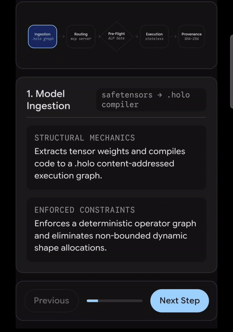

<!--
  Copyright (C) 2026 hologram-re contributors
  SPDX-License-Identifier: AGPL-3.0-only
-->

# hologram-re

```
  _           _                                  _
 | |__   ___ | | ___   __ _ _ __ __ _ _ __ ___   _ __ ___
 | '_ \ / _ \| |/ _ \ / _` | '__/ _` | '_ ` _ \ | '__/ _ \
 | | | | (_) | | (_) | (_| | | | (_| | | | | | || | |  __/
 |_| |_|\___/|_|\___/ \__, |_|  \__,_|_| |_| |_||_|  \___|
                      |___/   reverse engineering  v1
        pin: SNAPKITTYAGENT9NOVA/hologram-ai @ c9609c0
        license of this repo: AGPL-3.0-only
        license of the analyzed tree: MIT OR Apache-2.0
```

A reverse-engineering analysis of
[SNAPKITTYAGENT9NOVA/hologram-ai](https://github.com/SNAPKITTYAGENT9NOVA/hologram-ai)
at commit `c9609c0`. The upstream project is a Rust workspace of about 50,000
lines that downloads Hugging Face models, compiles them into content-addressed
`.holo` archives, runs inference natively and in WebAssembly, gates a request
through a small policy check, and appends a record to a log it calls a ledger.
Nothing from that tree is vendored as the product. This repository holds the
analysis, the Alloy models of the structural claims, the shell checks against
external authorities, and — as of the v1 drop — an independent executable
oracle under [`oracle/`](oracle/) that rebuilds the tensor, quant, tokenizer,
and regex machinery so the notes can be run, not only read.

**v1** is the first cut that can be read end to end: Team A notes, Team B
notes, both Alloy runners, the A check logs, the oracle workspace, and the
pipeline walkthrough below. It is not a claim that every scenario has been
traced. Rows still marked "not traced" in [`functions/B_gherkin.md`](functions/B_gherkin.md)
are open work. See [`HANDOFF.md`](HANDOFF.md).

## The walkthrough

Twenty-six seconds, five stages, shot on the pipeline card. The clip is the
claim. The notes under it are the verdict.

[](assets/pipeline-walkthrough.mp4)

[Download the walkthrough (mp4, 25.6 s)](assets/pipeline-walkthrough.mp4) ·
[poster frame](assets/pipeline-poster.png)

```
  INGEST          ROUTE           GATE            RUN             LOG
  .holo graph     mcp server      ALP Gate        stateless       SHA-256
      |               |               |               |               |
      v               v               v               v               v
 +---------+     +---------+     +---------+     +---------+     +---------+
 | safetensors    | hologram-api  | hologram-cnl  | elision       | archivum
 |  -> .holo      | first-match   | lex + Ap(1)   | no KV slot    | per-record
 |  compiler      | YAML table    | blocks "all"  | budget bytes  | SHA-256
 +---------+     +---------+     +---------+     +---------+     +---------+
      \_______________|_______________|_______________|______________/
                              one request, five claims
                         each claim scored, not assumed
```

## How a claim is scored

Every mathematical operation and every claimed property is written as a
function: signature, exact definition, constants taken from the code,
preconditions, postconditions, and the upstream `path:line`. Gherkin
scenarios and the prose in the upstream docs are written the same way and
traced to the step that is supposed to check them. Functions are defined
without `f32` / `f64`, using exact integers, exact rationals, or the
Goldilocks field \(p = 2^{64} - 2^{32} + 1\). Each floating-point path is
recorded as an approximation, with the rounding steps and the parity or
determinism claim it breaks. Structural invariants are modeled in Alloy 6.
A `check` with no counterexample means the property holds in the model, not
in the Rust.

| Verdict | Meaning |
|---|---|
| Implemented | The code enforces it for every input in the stated domain. |
| Asserted-only | A test, scenario, or doc asserts it, but the code does not enforce it in general. |
| Marketing | Prose only, with no mechanism and no test. |
| Absent | The mechanism does not exist, or the code does the opposite. |

The walkthrough uses a fifth label of its own, "enforced constraints." That
label is not a verdict. The five sections below take each card in order and
say which sentence survives contact with the tree at `c9609c0`.

## 1. Model ingestion

```
  safetensors bytes
        |
        |  header stream, tensor drain, dtype + shape
        v
  parametric graph  ---- compile ---->  .holo archive
        |                                    |
        | kappa_of = "blake3:" ++ hex(BLAKE3-256)
        v                                    v
  kappa map line                      32-byte footer
  ConstantId(n):label[@off+len]       BLAKE3 of preceding bytes
```

The card says the compiler extracts tensor weights and compiles them to a
content-addressed execution graph, and that it enforces a deterministic
operator graph and eliminates non-bounded dynamic shape allocations.

The extraction half is real. Team A's notes in
[`functions/A_safetensors.md`](functions/A_safetensors.md),
[`functions/A_onnx.md`](functions/A_onnx.md),
[`functions/A_quant.md`](functions/A_quant.md), and
[`functions/A_compilation.md`](functions/A_compilation.md) write the header
parse, the quant layouts, and the compile path as functions with upstream
line numbers. The v1 oracle drop runs that half: `oracle/crates/hologram-ai-safetensors`
builds the parametric decoder graph from a `config.json` plus a safetensors
file, and `oracle/crates/hologram-ai-quant` plus the hand-written WAT kernels
dequantize bit-exactly. The commit that added the drop recorded 62 Rust tests
and 15 WASM checks green.

Content addressing of the archive body is also real, and it is BLAKE3, not
SHA-256. `kappa_of` is `"blake3:"` plus 64 lowercase hex digits, length 71.
The official BLAKE3 known-answer tests match on the 35 vectors (sha256 of the
KAT file recorded in `checks/logs/`). The footer of a reassembled archive is
BLAKE3 of the preceding bytes. Determinism of a pure compile, given the same
bytes, follows from that. Determinism of a graph that still contains an
`Opaque` marker does not: dispatch relabels a surviving opaque op as
Identity and discards `op_type`. That is an import defect being papered over,
not an eliminated one. See [`functions/B_execution.md`](functions/B_execution.md)
EX-03.

The shape claim is narrower than the card. The oracle carries
`ir/shape/dim_expr.rs` and `dim_var.rs`, so symbolic dimensions exist as a
vocabulary. "Eliminates non-bounded dynamic shape allocations" is a property
of the compiled window, which is a concrete `usize` chosen before execute,
not a theorem that every dynamic dim has been discharged. A window that does
not fit the model's context fails loud on the staged provider and is silently
capped on the monolithic growable provider. Both behaviors are written in
[`functions/B_sampling.md`](functions/B_sampling.md).

## 2. Domain routing

```
        request.domain
              |
              |  ASCII case fold
              v
     +------------------+
     | routing.yaml     |
     | routes[0]        |-- match --> model
     | routes[1]        |
     | ...              |
     | default_model    |-- else ---> model
     +------------------+
     first match wins; a later duplicate is dead
```

The card says hologram-api, the MCP server, maps incoming context requests to
domain policy models, and that it validates API invocation scopes, identity
auth payloads, and domain boundary contracts.

The map is a YAML table. `resolve` returns the model of the first route whose
domain equals the folded query, otherwise `default_model`. The function is
total. The loader is plain serde and does not reject a domain listed twice, so
the second row can never fire. That is [`functions/B_session.md`](functions/B_session.md)
SE-02. There is no scope check, no identity payload, and no domain-boundary
contract in the handler that was read. The domain string is also not an input
to the pre-flight gate, so a "legal" domain and a "general" domain take the
same path. The card's enforced-constraints sentence is marketing relative to
`c9609c0`.

What the server does do is small and closed: unknown methods return JSON-RPC
`-32601`, a missing prompt returns `-32602`, a CNL parse error returns
`-32002`. The allowed branch logs the action and the routed model name. It
does not call a model. See [`functions/B_cnl.md`](functions/B_cnl.md) CN-02.

## 3. Pre-flight verification

```
  prompt
    |
    | whitespace split
    v
  action scan (case-sensitive, first hit)
    temperature+zero | deploy | scale | destroy | revoke | none
    |
    | token loop (lowercased)
    v
  primes: deploy=2 scale=3 ... all=1 destroy=NO ARM
    |
    v
  AST = Ap(first) then apply
    |
    +-- Ap(1)  -->  "Generation Blocked"     (the word "all", alone)
    |
    +-- else   -->  invariants_passed, log, return
                     temperature is stored, never compared
```

The card says the gate asserts structural constraints via abductive logic
programming before engine dispatch, and that it rejects policy-violating
queries at the edge with zero model token consumption.

Zero model tokens is true of this handler, because the handler does not
dispatch to an engine on either branch. The reject set is not a policy. Among
prompts that lex, the diagnostic is exactly the one-word prompt `all` (any
case, because the token loop lowercases). `all all` passes. `deploy` passes.
`temperature 5` passes. `destroy` cannot pass, because the action scan knows
the word and the lexer has no arm for it, so the prompt is an unknown token.
Alloy checks `gateIsSingletonAll` (expected UNSAT) and `temperaturePolicyEnforced`
(expected SAT, a counterexample). The stored `temperature: 0.0` is an f32
field that nothing compares. Domain never enters the function. ADR prose that
says the gate verifies temperature 0.0 for a named domain is marketing.

The "ALP logic engine" label on the card is the name of the crate
(`hologram-cnl`). The mechanism in the file is a two-phase scan and a prime
fold, not a search. Calling the fold abductive does not make the reject set
larger.

## 4. Governed execution

```
  prompt tokens
       |
       | remaining = max_window - |prompt|
       | budget    = min(max_tokens, remaining)
       v
  for k in 0..budget:
       session_for(|sequence|)
       +-- staged: bail if want > max_window
       +-- growable: geometric_window, silent cap
       |
       forward, no KV slot (dispatch: KvSlotRead/Write -> Identity)
       |
       temperature <= 0 --> argmax, first strict maximum, rng ignored
       temperature  > 0 --> unstable sort, f32/f64 softmax, SplitMix64
       |
       eos or stop string --> break
```

The card says inference uses stateless elision without a persistent key-value
cache, and that it guarantees zero residual cross-session data retention and
bounded memory.

The KV-cache half is implemented as a deletion. `KvSlotRead` and `KvSlotWrite`
lower to Identity. The comment in `dispatch.rs` says the injection pass does
not run and that reuse is content-addressed. Elision then skips a node whose
label was already resident. For a decoder whose tokens arrive as one
`input_ids` tensor, every token-dependent node recomputes on every step:
elision does not stand in for a cache. A skipped count that includes slices
is not evidence that a kernel output was reused. Both are in
[`functions/B_elision.md`](functions/B_elision.md) EL-04.

Memory is bounded only in the sense the residency budget defines. Resident
weight bytes never exceed the budget. The recorded peak does not cover the
true live weight of a stage that runs while others are resident: the peak
update is `max(resident, bytes)`, not `resident + bytes`. A failing admission
probe evicts a stage the budget could have held. A zero budget streams every
stage on every pass, which is the strict one-stage window and is implemented.
Cross-session retention is not zero in the store. A κ verified on the first
pass of a session is executed on the second pass without re-hashing, so a
swap in the store between passes is served. The scenario calls the no-re-hash
half a feature. The integrity half is absent. First touch in a fresh session
does fail loud.

Greedy generation is deterministic. Temperature above zero is not pinned to a
rounding spec, and `top_k = 1` equals argmax only on tie-free rows, because
the sort is unstable. The browser trim drops oldest turn pairs while the
counted prompt exceeds the context, and it keeps the pending message, but a
single message larger than the context is sent anyway and the engine then
rejects it. A prompt that fills the window exactly produces an empty
completion, budget 0, which the comment does not call an error.

## 5. Ledger provenance

```
  event = { timestamp: now, event_type, domain, payload }
  hash  = hex(SHA-256(json(event)))
  line  = { hash, event }
        |
        | open(path, create | append)
        | writeln, error ignored
        v
  file of independent lines
  no prev-hash, no signature, no verify API
```

The card says the stage logs request hash, verification proof, and model
outputs to an immutable ledger, and that it generates SHA-256 audit trails
appended to immutable storage.

The hash algorithm on this path is SHA-256, which is the one place the card's
"SHA-256" badge matches the code. Each record's hash covers its own event and
can be recomputed. That is [`functions/A_archivum.md`](functions/A_archivum.md)
AR-02 P1. Immutability is not a property of the file. `O_APPEND` only affects
where this process writes. Any other writer can truncate, edit, delete, or
reorder lines, and each remaining line still validates against itself, because
there is no previous-hash field, no Merkle structure, no signature, and no
verify API. The crate is 59 lines and has no tests. "Every inference event is
logged" is asserted by callers in the API process, not enforced by the logger,
and a failed write is ignored while the function still returns `Ok`. The
badge on the card and the hash in the record are different claims. The badge
says the trail is immutable. The record says it hashed itself.

κ-labels elsewhere in the system are BLAKE3. Model labels from `uor-addr` are
a separate SHA-256 axis. The walkthrough collapses those three into one
"Provenance / SHA-256" node. They are not one node.

## What v1 ships

```
  hologram-re
  |
  +-- functions/     the catalog, one function per claim
  |     A_*           addressing, acquisition, safetensors, ONNX,
  |                   quant, compilation, archivum, gherkin s0-s2, f32
  |     B_*           execution, sampling, elision, tokenizer, CNL,
  |                   session, conformance, gherkin s3-s4, f32, docs
  |
  +-- alloy/         Alloy 6 models and the runners
  |     A_*.als       addressing, quant
  |     B_*.als       execution, sampling, window-64, elision,
  |                   tokenizer, CNL, session, conformance
  |     run-A.sh      one JVM per command, log under alloy/logs/
  |     run-B.sh      same contract; ALLOY_SKIP_WINDOW64=1 to skip the slow file
  |
  +-- checks/        shell checks against external authorities, with logs
  |
  +-- oracle/        the v1 drop: executable oracle, AGPL-3.0-only
  |     crates/hologram-ai-common        IR, dtype, shape, op vocabulary
  |     crates/hologram-ai-safetensors   parametric graph from config + tensors
  |     crates/hologram-ai-quant         Q4_0 / Q8_0 schemes and encode
  |     crates/hologram-ai-tokenizer     BPE, unigram, wordpiece, specials
  |     crates/hologram-ai-regex         pre-tokenizer split
  |     wasm/                            hand-written WAT dequant kernels
  |
  +-- assets/        this walkthrough (mp4, gif, poster)
  +-- HANDOFF.md     what the next pass should open first
```

The oracle is a standalone workspace: five crates, no git dependencies,
`half` pinned to 2.4.1, `thiserror` pinned to 2.0.3, `Cargo.lock` committed
for a Rust 1.75 build. It was rebuilt from the upstream tree under an
explicit source-specific waiver of the per-file-header extraction rule, dated
2026-10-07, and it is AGPL-3.0-only like the rest of this repository. It is
the thing you run when a note says "bit-exact" and you want a process rather
than a paragraph. It is not a second copy of the product, and it does not
include the API, the CNL gate, or the archivum logger. Those stay in the
notes, because reimplementing a 59-line logger would not make the missing
chain appear.

## Reading order

Start with the card you care about, then the note it points at.

1. Ingestion and addressing: `functions/A_addressing.md`, then
   `functions/A_safetensors.md`. The κ store resolves a path by joining the
   label; a label containing `../` is not rejected.
2. Quant and the oracle: `functions/A_quant.md`, then
   `oracle/crates/hologram-ai-quant`.
3. The gate: `functions/B_cnl.md`. One page. The reject set is the point.
4. Execution and the cache claim: `functions/B_elision.md` and
   `functions/B_sampling.md`.
5. The ledger: `functions/A_archivum.md`. Short, and the gap is the design.
6. Whatever `functions/B_gherkin.md` still marks "not traced." The numeric
   claims in `execution_parity` and `chunked_head` are the highest-value
   unread step bodies.

Alloy checks the models, not the Rust. Expected UNSAT and expected SAT in the
B notes are predictions from the model text. `alloy/run-B.sh` has not been
executed in the commit that added the notes. The A runner has logs.

## What this release is not

It is not a security audit of a deployment, and it is not a patch set against
upstream. It does not copy upstream source into `functions/`. The oracle is
the only executable reconstruction, and its provenance line is in
[`oracle/README.md`](oracle/README.md). Verdicts can move when a step body
that is still marked "not traced" turns out to enforce a claim the prose only
asserts. Until that reading lands, the verdict on the card is the verdict in
the note, not the sentence on the glass.

## License

AGPL-3.0-only. See [`LICENSE`](LICENSE). The analyzed upstream project is
licensed MIT OR Apache-2.0 by its authors.
